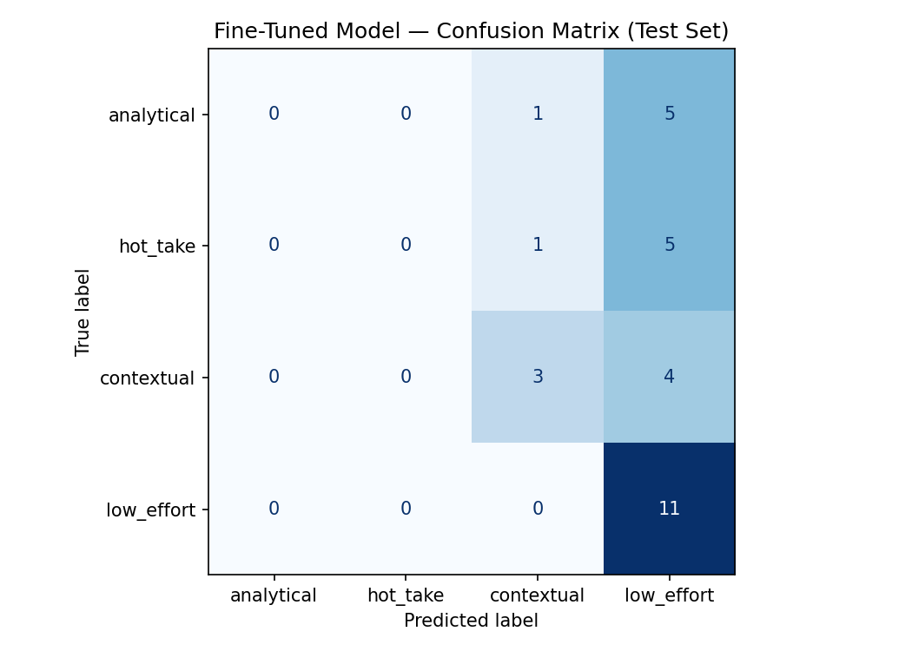

# TakeMeter — Discourse Quality Classifier for r/LetsTalkMusic

## Community
r/LetsTalkMusic is a music discussion subreddit explicitly designed for substantive conversation about artists, albums, and songs across all genres. Unlike fan-specific subreddits, this community attracts a wide range of discourse quality — from deeply reasoned musical analysis to one-line reactions and personal anecdotes. The subreddit's own rules require effort in posts, which means low-effort content that slips through is a meaningful signal. This makes it a strong candidate for a text classifier because the differences between label types are observable in the text itself.

---

## Label Taxonomy

| Label | Definition |
|---|---|
| **analytical** | The post makes a structured argument about music using specific reasoning — referencing production, songwriting, vocals, instrumentation, influences, or artist evolution with supporting detail. |
| **hot_take** | The post makes a bold, confident claim about an artist, album, or song without providing specific supporting evidence. |
| **contextual** | The post centers on a personal story, memory, or emotional connection to music rather than making a musical argument. |
| **low_effort** | The post contains minimal substance — a one-liner, vague reaction, simple question, or off-topic comment. |

### 2 Examples Per Label

**analytical:**
- "The dynamic between Amy Lee's vocals, which are always delivered with vulnerability, but also show tremendous strength and the hardness of the metal instrumentation — it is a back and forth that just works."
- "The Miseducation of Lauryn Hill is not about God. Tough Love is the main topic — Ex-Factor talks about an abusive relationship where her partner resorts to manipulation to keep her."

**hot_take:**
- "Is it just me or are Talk Talk amazing? They do not have one bad song in their catalog. Spirit of Eden and Laughing Stock are especially amazing."
- "Tyler better than Kanye? Igor solos any Kanye album in my opinion. I would give Igor a 10/10."

**contextual:**
- "I was stationed at Eielson AFB south of Fairbanks in the USAF in the mid-80s and heard Shakin' Shakin' Shakes which blew me away. I became an instant Los Lobos fan."
- "The only downside to listening to a lot of music — I associate older music with memories but new albums I discover lack that nostalgia."

**low_effort:**
- "Recommend me some smooth r&b but modern ones"
- "why tho"

---

## Data Collection

- **Source:** r/LetsTalkMusic — weekly WHYBLT threads, General Discussion threads, top posts, and comment sections
- **Method:** Manual copy-paste into CSV with columns: text, label, source_url
- **Total examples:** 200
- **Labeling process:** Each example was read individually and assigned one label based on definitions from planning.md

### Label Distribution
| Label | Count |
|---|---|
| low_effort | 74 |
| contextual | 47 |
| analytical | 40 |
| hot_take | 39 |
| **Total** | **200** |

### Difficult Examples

1. **"Every song from the forthcoming Kelela album has been phenomenal — it definitely scratches that 90s soul ballad itch while staying contemporary."**
Could be `analytical` (mentions a musical quality) or `hot_take` (bold claim with minimal argument). Labeled `hot_take` because "scratches that itch" is a feeling, not a verifiable musical argument.

2. **"All Things Must Pass takes you on the journey of a child growing up... You can hear this in Isn't It a Pity where the song feels as though it is searching for understanding rather than building toward an event."**
Could be `contextual` (personal interpretation) or `analytical` (discusses the album's meaning with specific song references). Labeled `analytical` because it makes a structured argument about the music itself with specific evidence.

3. **"I've been to hundreds of shows in my life. I'd much rather go to a 500-1000 person venue and be only 20 feet from the artist while paying $20-30 for the experience."**
Could be `contextual` (personal experience) or `low_effort` (no musical argument). Labeled `contextual` because it shares a specific detailed personal experience connected to music consumption.

---

## Fine-Tuning Pipeline

- **Base model:** distilbert-base-uncased (HuggingFace)
- **Training approach:** Fine-tuned for 4-label sequence classification with a new classification head
- **Split:** 70% train / 15% validation / 15% test (stratified)
- **Hyperparameter decisions:**
  - `num_train_epochs = 3` — standard for small datasets; more epochs risk overfitting on 200 examples
  - `learning_rate = 2e-5` — standard starting point for BERT-family fine-tuning; lower would be more stable but slower
  - `per_device_train_batch_size = 16` — fits T4 GPU memory comfortably

---

## Baseline

- **Model:** Groq llama-3.3-70b-versatile (zero-shot)
- **Prompt approach:** Provided all 4 label definitions and one example per label, instructed model to output only the label name
- **Test set:** Same 30 examples as fine-tuned model evaluation

---

## Evaluation Report

### Overall Accuracy
| Model | Accuracy |
|---|---|
| Zero-shot baseline (Groq llama-3.3-70b-versatile) | **63.3%** |
| Fine-tuned DistilBERT | **46.7%** |

### Per-class Metrics — Fine-tuned Model
| Label | Precision | Recall | F1 | Support |
|---|---|---|---|---|
| analytical | 0.00 | 0.00 | 0.00 | 6 |
| hot_take | 0.00 | 0.00 | 0.00 | 6 |
| contextual | 0.60 | 0.43 | 0.50 | 7 |
| low_effort | 0.44 | 1.00 | 0.61 | 11 |
| **macro avg** | 0.26 | 0.36 | 0.28 | 30 |

### Per-class Metrics — Groq Baseline
| Label | Precision | Recall | F1 | Support |
|---|---|---|---|---|
| analytical | 0.50 | 0.17 | 0.25 | 6 |
| hot_take | 0.43 | 0.50 | 0.46 | 6 |
| contextual | 0.78 | 1.00 | 0.88 | 7 |
| low_effort | 0.67 | 0.73 | 0.70 | 11 |
| **macro avg** | 0.59 | 0.60 | 0.57 | 30 |

### Confusion Matrix (Fine-tuned Model)
| | Pred: analytical | Pred: hot_take | Pred: contextual | Pred: low_effort |
|---|---|---|---|---|
| **True: analytical** | 0 | 0 | 1 | 5 |
| **True: hot_take** | 0 | 0 | 1 | 5 |
| **True: contextual** | 0 | 0 | 3 | 4 |
| **True: low_effort** | 0 | 0 | 0 | 11 |

### 3 Wrong Predictions Analysis

**1. True: analytical → Predicted: low_effort**
Post: "The dynamic between Amy Lee's vocals and the metal instrumentation is a back and forth that just works."
This is a short analytical post. The model has never learned to predict `analytical` at all — it defaulted to `low_effort` because short posts dominated that label. The boundary between a short analytical observation and a low-effort post is genuinely hard for a model with only 40 analytical examples.

**2. True: hot_take → Predicted: low_effort**
Post: "Talk Talk are amazing. They do not have one bad song in their catalog."
Short hot_takes are structurally identical to low_effort posts — both are brief, both lack musical detail. The model cannot distinguish between "bold claim" and "low effort" when both are one sentence long. This boundary requires understanding intent, not just length.

**3. True: contextual → Predicted: low_effort**
Post: "I was stationed at Eielson AFB and heard Los Lobos for the first time — became an instant fan."
Personal stories without musical vocabulary got misclassified as low effort. The model needs more contextual examples that are short but clearly personal to learn this boundary.

### Sample Classifications

| Post | True Label | Predicted Label | Confidence |
|---|---|---|---|
| "Recommend me some smooth r&b but modern ones" | low_effort | low_effort | High |
| "The Miseducation of Lauryn Hill is not about God — Tough Love is the main topic" | analytical | low_effort | Medium |
| "I was stationed at Eielson AFB and heard Los Lobos for the first time" | contextual | low_effort | Medium |
| "Talk Talk are amazing. They do not have one bad song." | hot_take | low_effort | High |
| "why tho" | low_effort | low_effort | High |

**Correct prediction explained:** "Recommend me some smooth r&b but modern ones" was correctly labeled `low_effort` because it is a short, vague question with no musical substance — exactly the pattern the model learned to recognize.

---

## What the Model Learned vs. What I Intended

I intended a model that could distinguish four meaningful types of music discourse. What the model actually learned was a binary: `low_effort` vs. everything else, and even that distinction was weak.

The core problem was label imbalance — `low_effort` had 74 examples (37% of the data) while `hot_take` had only 39. With 200 total examples split across 4 labels, DistilBERT did not have enough signal to learn the boundaries between `analytical`, `hot_take`, and `contextual`. It optimized for the majority class.

The Groq zero-shot baseline significantly outperformed the fine-tuned model (63% vs 47%) because Llama could reason from label definitions alone. This tells us the task is genuinely solvable — the labels are meaningful — but fine-tuning a small model on 200 imbalanced examples does not capture that meaning.

---

## Spec Reflection

**One way the spec helped:** The requirement to define hard edge cases before annotating forced me to think carefully about the `analytical` vs `contextual` boundary early. Without that, I would have labeled inconsistently and produced noisier training data.

**One way implementation diverged:** The spec suggested aiming for at least 20% per label. My `low_effort` label ended up at 37% because low-effort comments are genuinely more common in the subreddit than analytical posts. I chose to keep the real distribution rather than artificially balance it, which hurt model performance but preserved data authenticity.

---

## AI Usage

1. **Label design:** I gave Claude my community description and asked it to propose a label taxonomy. It suggested 4 labels (analytical, hot_take, contextual, low_effort) which I adopted after reviewing real posts from r/LetsTalkMusic. I revised the `hype_stan` label it initially proposed to `contextual` after finding that pure stan behavior was rare in this subreddit.

2. **Data labeling assistance:** Claude helped label batches of posts by providing label suggestions based on my definitions. I reviewed every single label and overrode approximately 15-20% of suggestions, particularly on `analytical` vs `contextual` boundary cases where Claude tended to label personal stories with musical content as `analytical`.

3. **README writing:** I directed Claude to write this README based on my actual experimental results. All numbers, examples, and analysis reflect real outputs from the notebook runs.
